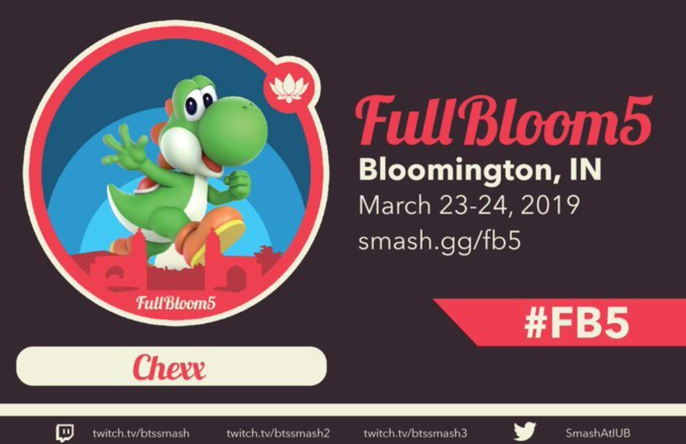

# Progress Documentation
Going to use this page as a place to write about why and how this is all happening. Think of it like a really long and useless blog except there's probably a funny pun tucked away in this trash heap.

## My History with Smash Bros (the why)
My first experience with Smash Brothers came when I was like 8 or 9, when I got my ass kicked by my older cousins. It was my first fighting game, so it was unlike anything I ever played and I really didn't understand how to play. Over ten years later, not much else has changed. It's a game with a lot of characters that I like, but it is very much not my jam. But I still buy the new ones and still have a good time with them. One thing that has changed, however, is how I came to really appreciate competitive Smash Brothers. I'm not an avid fan or anything but I think it's absolutely fascinating to watch, especially the big tournaments. It's a lot like the NBA for me, I'll loosely follow it throughout the season - but will tune in for the Finals. Also like the NBA, I watch it much better than I can play it.

So how did I get here? Well when I was in grad school, one of my best friends ran the big Smash Brothers tournament - Full Bloom. They were looking for volunteers to help keep things running, so I pitched in to help with check-in. Now I'm not sure how it happened, but I also ended up writing a creating a little python program to help speed up check-in and generate these cool player badges. The program was a dumpster fire but it worked(ish)! And I had a lot of fun at the tournament learning the techniques and vocabulary of it all.

Now I actually moved in with that friend so I ended up watching more smash tournaments with him, which really got me hooked. One tournament in particular showed something I hadn't seen yet - a chart with some post-match analytics. Being a data scientist, I was really interested in the chart...and how useless I thought it was. I'm not able to find the actual chart now, but it was basically just a line chart that showed the number of stocks (lives) each player had left over the duration of the match. So it just showed two lines gradually decreasing from five until one line got to zero and the match ended. But it wasn't properly labeled on the horizontal axis and had a weird time grouping so I really didn't learn anything cool from the chart. But what it did do correctly is that it did get me thinking was "what charts would I rather see?" and "how could I make them?". Fast forward almost five years later and I've decided to give a bit of a go through this project.

## Project Goals (the how)
To put it simply - the core goal of this project is to create meaningful post-match analytics for Smash Brothers Melee matches. It's not about understanding *who* won, it's how about *how*. Something that changes your perspective on how players are winning or losing. Do players do damage in quick powerful combos, or through steady attacks that chip on damage? Are players attacking more in the air, or on the ground? How do these strategies change when a player is high damage or low on stocks? These are the types of questions the Melee Analytics Project should be able to answer.

**TODO: add dummy drafts of output charts**

So how should this thing actually work? Well no matter what it needs to be quick, so that these questions can be answered immediately after a match - no one cares about analytics on a semi-finals match if you're halfway through the finals! And it needs to be automatic - I don't want to have to manually enter data or give this thing constant attention to keep it running. It should just be a script I tell to watch a stream and it does the rest for me.

## Pipeline Overview

## Training Data

## Model Info and Performance

