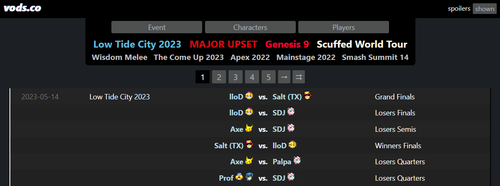

# Progress Documentation
Going to use this page as a place to write about why and how this is all happening. Think of it like a really long and useless blog except there's probably a funny pun tucked away in this trash heap.

## My History with Smash Bros (the why)
My first experience with Smash Brothers came when I was like 8 or 9, when I got my ass kicked by my older cousins. It was my first fighting game, so it was unlike anything I ever played and I really didn't understand how to play. Over ten years later, not much else has changed. It's a game with a lot of characters that I like, but it is very much not my jam. But I still buy the new ones and still have a good time with them. One thing that has changed, however, is how I came to really appreciate competitive Smash Brothers. I'm not an avid fan or anything but I think it's absolutely fascinating to watch, especially the big tournaments. It's a lot like the NBA for me, I'll loosely follow it throughout the season - but will tune in for the Finals. Also like the NBA, I watch it much better than I can play it.

So how did I get here? Well when I was in grad school, one of my best friends ran the big Smash Brothers tournament IU put on - Full Bloom. They were looking for volunteers to help keep things running, so I pitched in to help with check-in. Now I'm not sure how it happened, but I also ended up writing a creating a little python program to help speed up check-in and generate these cool player badges. The program was a dumpster fire but it worked(ish)! And I had a lot of fun at the tournament learning the advanced techniques and vocabulary of a game I only played casually.

Now I actually moved in with that friend so I ended up watching more smash tournaments with him, which really got me hooked. One tournament in particular showed something I hadn't seen yet - a chart with some post-match analytics. Being a data scientist, I was really interested in the chart...and how useless I thought it was. I'm not able to find the actual chart now, but it was basically just a line chart that showed the number of stocks (lives) each player had over the duration of the match. So it just showed two lines gradually decreasing from five until one line got to zero and the match ended. But it wasn't properly labeled on the horizontal axis and had a weird time grouping so I really didn't learn anything cool from the chart. But what it did do correctly is that it did get me thinking..."what charts would I rather see?" and "how could I make them?". Fast forward almost five years later and I've decided to give a bit of a go through this project.

## Project Goals (the how)
To put it simply - the core goal of this project is to create meaningful post-match analytics for Smash Brothers Melee matches. It's not about understanding *who* won, it's how about *how*. Something that changes your perspective on how players are winning or losing. Do players do damage in quick powerful combos, or through steady attacks that chip on damage? Are players attacking more in the air, or on the ground? How do these strategies change when a player is high damage or low on stocks? These are the types of questions the Melee Analytics Project should be able to answer.

**TODO: add dummy drafts of output charts**

So how should this thing actually work? Well no matter what it needs to be quick, so that these questions can be answered immediately after a match - no one cares about analytics on a semi-finals match if you're halfway through the finals! And it needs to be automatic - I don't want to have to manually enter data or give this thing constant attention to keep it running. It should just be a script that watches a stream and does everything on it's own.

## Pipeline Overview
Before we can make any cool charts, we've got to make a cool a time-series data structure that has player stocks, damage, and positions over the course of a match. And to make that time-series structure, we need to be able to find player stocks, damage and positions in a single point in time. The pipeline below is how we'd like to get there.

#### Single Frame Pipeline

Once we're cooking with this above, then we can really party hard when we get a series of frames from a game. As of now, that part is a little more abstract and doesn't have a neat lil diagram. Why? Well honestly because I have no clue how this thing is gonna perform. In a perfect world, it can process a frame in less than 1/60th of a second. Smash melee runs at 60 frames per second. So processing a frame every second means we're getting every 60th frame. Which feels slow! Crazy to think that processing in one second isn't fast enough! So I'm going to assemble the pipeline above and that I'll make some decisions from there. Since I'm running everything locally, this will be extremely dependent on my hardware - right now I'm rocking a 2080 Super GPU but this could be justification to swipe the card and get something with more CUDA cores/VRAM 🤠

And as for the charts. I'll probably end up making them in Seaborn, but it really depends on which python graphing library gives me the least headaches that day. Seaborn, Plotly, Matplotlib, doesn't matter, all of them aren't very intuitive and can be really frustrating when you're trying to build perfect charts. So it's all up in the air just like everything else. ANYHOO we'll get there when we get there. For now lets talk about how we're going to build this beefcake.

## Training Data
Let's start with building that Faster R-CNN Model. In order for the model to recognize the clock, characters, stocks, and damage from an image, we're gonna need a lot a training data for it to learn what to look for. It's the classic case of monkey see, monkey do. Since we want our monkey to do we gotta help our monkey see through the training data. This means we'll need to build a massive library of images of Melee gameplay, and create annotations on those images for what we expect it to find. 

### Getting the Images
Initially I wanted to capture the training images directly from a Gamecube but decided against for three reasons.
1. Once this is up and running, I'll be getting the feed of images from a stream on YouTube or Twitch, not the direct Gamecube feed. And those streams will have overlays that can have event logos, player camera feeds, and ads. So the training data needs those too so the final model isn't seeing those for the first time.
2. It would take a lot of time for me to play matches with a variety of characters and on a variety of stages. And since I'm definitely not a pro player, that feels like a great way to introduce some bias to the model.
3. I don't have a capture card and don't wanna pay for one. And I think my parents threw away my Gamecube?
   
So with all of that being said, I decided to roll with using images from historical Melee competitions. That way I can get a nice variety of characters and stages as well as getting variety in the overlays that are added to the stream. 

Instead of manually searching YouTube to find those historical streams from competitions, I decided to search around and see if I could find a nice website where they where they were already collected. And sure enough I found the perfect website for me, [vods.co](https://vods.co/melee). This website has thousands of links to matches dating back to basically when the game came out - which is unreal. Better yet it also had the name/date of the event, the names of the competitors, and even the characters they used. Naturally they didn't have a way for that information to be exported so I wrote some python code to scrape it. Now I know, I know. Scraping is bad. But I wrote the script to be a "polite" scraper in that it's not fast and mimics a regular Chrome session. And to whoever runs that site - please let me pay you for the awesome work you do, I would if I knew who you were! As for the code to pull this data, the functions are in [get_melee_vods.py](https://github.com/brianfunk3/melee_analytics_platform/blob/main/get_train_data/get_melee_vods.py) and was executed in cell 2 in the [get_training_data notebook](https://github.com/brianfunk3/melee_analytics_platform/blob/main/get_train_data/get_training_data.ipynb)

Once I had all of those YouTube video ids with historical Melee matches, I needed a way to randomly sample frames from them to use in training. Of course I could have done that manually but like...gross. So again, I turned to old reliable python. Just like with web scraping, I already have experience with accessing YouTube videos via python libraries so it was really all about digging through my old code and cleaning up functions I had already used. And writing a wrapper function for all of them that would iterate over those video ids and sample images. All of those functions are found in [get_images_from_vods.py](https://github.com/brianfunk3/melee_analytics_platform/blob/main/get_train_data/images_from_vods.py). By the end I had roughly 6.4k images that were ready to be labeled (plus a pipeline for getting more if I needed them 🦖)

## Annotating the Data
After a bit of looking around online, I decided to use [Label Studio](https://labelstud.io/) for creating the annotations. It's open source and free for what I needed to do, and it seemed easy enough to set up. And it was. So I set out on my adventure of drawing cute boxes on thousands of images. After dozens of hours, a handful of college basketball games, and probably too many cups of coffee, I had labelled...like 500 images. I can see why people unload labeling tasks to Amazon MTurk. But I'm a cheapo so I don't want to do that. For now I'll keep my 500 labels, start modeling, and will get back to labeling in a later section.

## Model Info and Performance
Now that (at least some 🥴) images are annotated, we're ready to start building out some Faster R-CNN models! Finally! I started with the code in [this tutorial](https://debuggercafe.com/a-simple-pipeline-to-train-pytorch-faster-rcnn-object-detection-model/) since it seemed easy enough to start with. But that code was EXTREMELY rigid and not at all how I wanted to work. I wanted the ability to iteratively build and test models - which this tutorial didn't support. The tutorial also was meant to be run in the command line and I'm a Jupyter Lab boy so some more adjustments were needed. In the end, these are some of the major changes I made were made to better support the environment I wanted to work in

* Move from command line to single function for training model
* Parameterization of project directories, epochs, and image resize sizes instead of hard coded values
* The names of the classes are dynamically pulled from the annotations and don't need to be provided up front
* Splitting of data into train and validation sets happens in function and size is controlled by parameter
* Parameter for overall data sample to use
* Additional validation step saving out validation images with predictions to better understand performance
* Each run of the function saves in a new subdirectory for trial and iteration without overwriting
* A parameter to downsample some classes if the class is overbalanced compared to other classes annotations
* A parameter for the minimum number of annotations a class must have to be used
* Each run saves a JSON parameter file to know what parameters were used for the run
* A function to automatically export data from Label Studio to the proper path for modeling

With all of these changes made - its became much much much easier to iterate and try new models. I only need to update a few parameters and I can be spinning up models left and right with ease. The full codebase with changes can be found in the [pascal_voc_xml_modeling directory](https://github.com/brianfunk3/melee_analytics_platform/tree/main/pascal_voc_xml_modeling)

And let's see how our model performed. Initially I just wanted to test character tracking so I didn't have any labels for the clock, stocks, or damage. And the results were trash! Oops All Fox.

This was where I realized I needed to add class balancing since I realized there was bias in some characters being more used than others. Once I added that and a few more annotations, things really started cooking.

Now that we proved this thing could work for tracking characters - I started to add the annotations for the clock, stocks, and damages. And this was when I really learned how BORING IT IS TO DRAW BOXES. Like absolutely brutal. I spent probably 10 hours drawing those boxes on like 450 images and I nearly broke. But the results were cool!

Now that we know things can work, we really just need to annotate the rest of our data. Which sounds horrible and might cause my death. So we're going to try something a little sneaky. 

## Modeling to Draft Annotations
Label Studio uses and SQLITE3 database to store everything. What if we use our in-progress model to make predictions on all images we still need to annotate, then use some python SQL magic to add those predictions to that SQLITE3 database as draft annotations? Then I can open them up and review/edit those annotations without having to make them all from scratch. It'd be complicated to get up and running but I'd much rather do that than draw more boxes. In progress now!